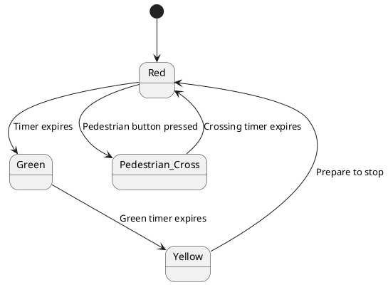

# Gishushu Traffic Light System

Welcome to the **Gishushu Traffic Light System** repository! This project includes a state diagram for managing vehicle and pedestrian traffic at the Gishushu intersection. The state diagram, created with PlantUML, outlines the primary states and transitions involved in controlling traffic flow.

---

## 📋 Specifications

### **States**

- 🔴 **Red Light**: Stops vehicle traffic.
- 🟢 **Green Light**: Allows vehicle traffic to proceed.
- 🟡 **Yellow Light**: Prepares traffic to stop.
- 🚶 **Pedestrian Cross**: Allows pedestrians to cross safely.

### **Transitions**

- 🔴 **Red to 🟢 Green**: Changes when the timer expires.
- 🟢 **Green to 🟡 Yellow**: Changes when the green timer expires.
- 🟡 **Yellow to 🔴 Red**: Prepares vehicles to stop and returns to Red.
- 🔴 **Red to 🚶 Pedestrian Cross**: Activates if a pedestrian button is pressed.
- 🚶 **Pedestrian Cross to 🔴 Red**: Returns to Red after the pedestrian crossing timer expires.

---

## 📖 Key Terms

- **State**: A specific condition or status of the traffic light system at a given time.
- **Transition**: The process of changing from one state to another.
- **Timer**: A device or mechanism that measures and controls the duration of each state.
- **Pedestrian Button**: A button that pedestrians can press to request a crossing signal.

---

## 📊 Diagram

To visualize the traffic light system state transitions

Simply copy this code into your PlantUML viewer to see the traffic light system's state diagram.

---

## 🚀 Usage

To view the state diagram, follow these steps:
1. Copy the PlantUML code snippet above.
2. Paste it into any PlantUML-compatible viewer or editor.
3. Visualize the state transitions in the traffic light system.

---

## 🤝 Contributing

Contributions are always welcome! If you have suggestions or improvements, please feel free to:
- **Submit a pull request**
- **Open an issue**

---

## 📄 License

This project is licensed under the **MIT License**. See the [LICENSE](LICENSE) file for more details.

---

